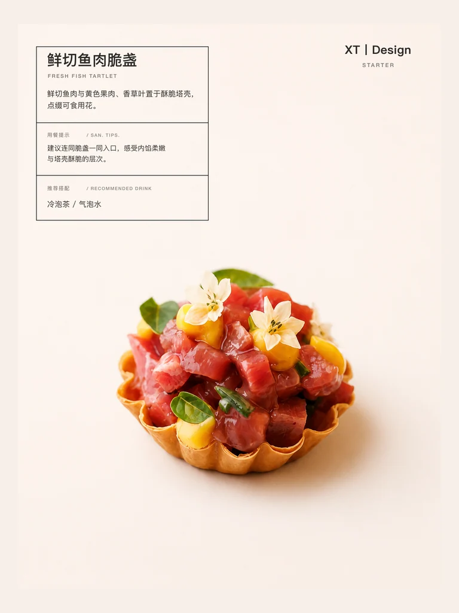
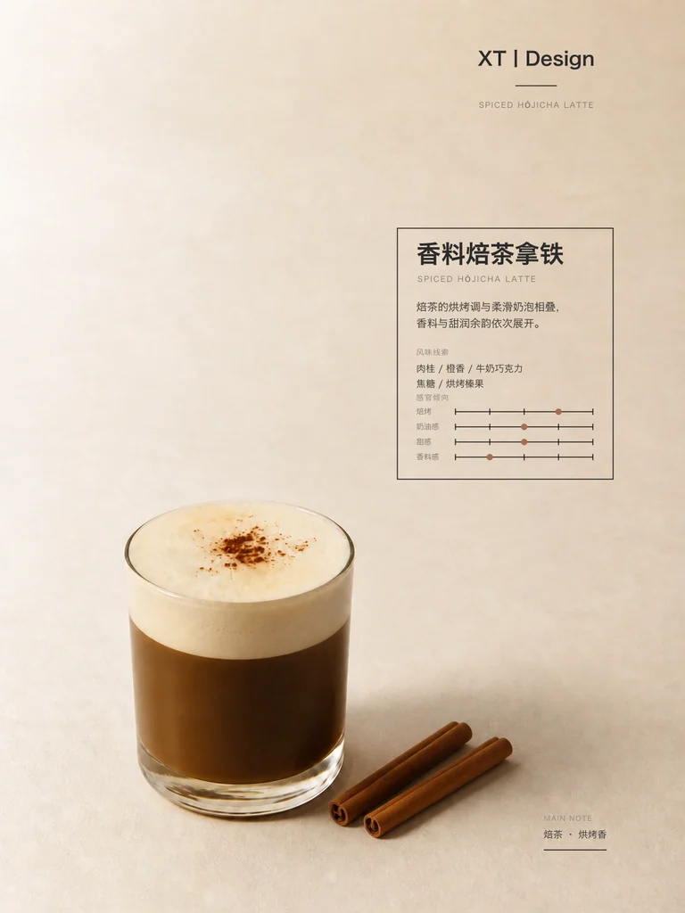
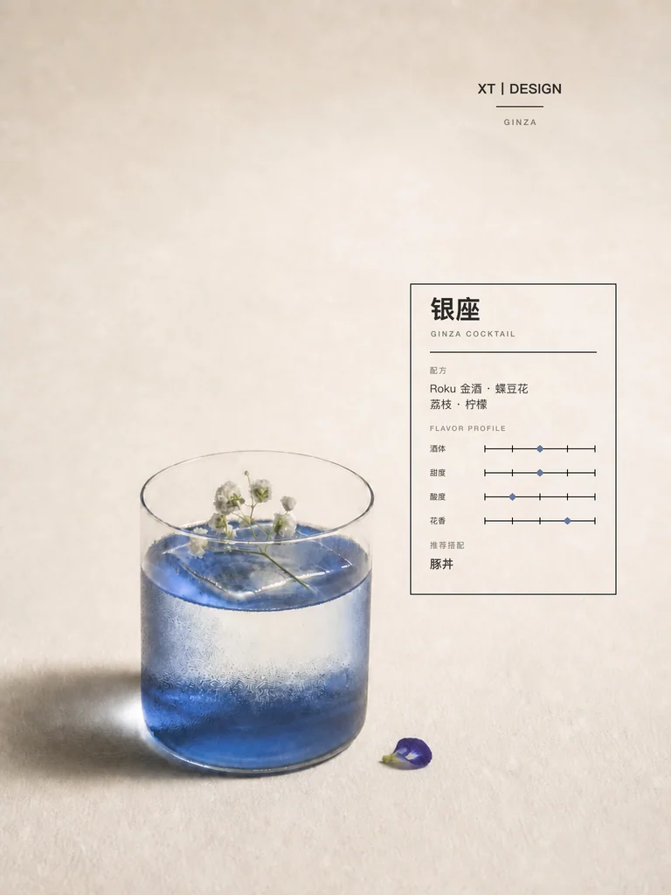

# Menu Generator

把一张菜品、甜点、咖啡、鸡尾酒或其他餐饮照片，转化为安静、克制、具有高级餐厅编辑感的 **3:4 单页菜单海报**。

`menu-generator` 是一个面向 Codex 的视觉生成 Skill。它会先询问需要中文还是英文版本，再理解并保留原始菜品与器皿，根据食品或饮品类型动态选择信息模块、摄影视角与版式系统，最终输出带有可靠排版的精致菜单视觉。

> 这不是电商详情页生成器，也不是多页菜单目录模板。它专注于一张照片、一道菜或一杯饮品，以及一张完成度足够高的单页视觉。

## 效果预览

以下配图均由 `menu-generator` 的实际工作流生成，并压缩为适合 GitHub README 浏览的 3:4 预览图。

| 食品 · Starter | 饮品 · Hōjicha | 饮品 · Cocktail |
|---|---|---|
|  |  |  |

- 食品示例使用“菜品身份 / 用餐提示 / 推荐搭配”分区，内部横线完整连接左右外框，不使用风味刻度。
- 饮品示例保留独立器皿，并使用饮品专属的紧凑风味线系统。
- 所有示例都采用暖色留白背景、确定性文字排版和完整四边信息框。

## 核心能力

- **主体保真**：保留菜品身份、原始摆盘、器皿和关键装饰，不随意改变可识别细节。
- **中英文版本选择**：开始制作前明确询问中文或英文，所有主要菜单信息使用所选语言，不擅自默认或混用。
- **专业抠图与重建**：移除桌面、手部和无关环境；必要时依据原图重建更合适的三分之四视角。
- **单体食物容器补全**：只有当一个独立食物完全没有盘、碗、托盘、衬纸、包装或可食用承托时，才补充一个合适且低调的容器；已有容器绝不叠加或替换。
- **食品 / 饮品分流**：食品使用用餐提示与搭配信息；独立饮品使用紧凑的 3–4 轴风味刻度。
- **动态信息系统**：只选择有证据支持的 2–4 个核心模块，不把所有字段机械地塞进同一张卡片。
- **确定性文字排版**：摄影底图不依赖图像模型生成文字，中文或英文内容通过 SVG、HTML 或图像合成单独完成。
- **严格质量门禁**：检查 3:4 比例、主体尺度、器皿完整性、边缘质量、结构线、文字间距和信息可信度。

## 视觉方向

- 低饱和暖灰、象牙白或柔和米色背景
- 自然柔光与可信的接触阴影
- 略微俯视的三分之四正面视角
- 大面积留白、轻微不对称和克制的信息设计
- 一张完整闭合的黑色细线信息框
- 食物始终是第一视觉层级，文字与装饰保持从属

## 输入要求

### 必填

1. 至少一张清晰可用的菜品或饮品照片
2. 中文版或英文版的明确选择；如未说明，Skill 会在最开始询问
3. 餐厅展示名的准确写法，包括大小写和分隔符

### 可选但推荐

- 菜品或饮品名称
- 主要食材或配方
- 价格
- 酒精属性
- 饮食声明
- 推荐搭配
- 招牌、季节限定或主厨推荐状态

用户提供的信息视为权威信息。Skill 不会虚构价格、隐藏食材、产地、酒精含量、饮食声明或招牌身份。

## 输出内容

每次任务交付三部分：

1. 一张最终 3:4 菜单图片
2. 与页面一致、使用所选语言的菜单文案
3. 简短的视觉说明，包括版式选择、构图逻辑和辅助物件依据

## 使用示例

```text
请使用 menu-generator，把这张菜品照片做成高级餐厅 3:4 菜单海报。

版本：中文
餐厅名：山岚 SANLAN
菜品名：炭烤和牛
主要食材：和牛、土豆泥、芦笋、黑胡椒汁
价格：¥288
```

饮品示例：

```text
请使用 menu-generator，把这张咖啡照片做成 3:4 编辑感菜单海报。

版本：英文
餐厅名：山岚 SANLAN
饮品名：桂花燕麦拿铁
配方：浓缩咖啡、燕麦奶、桂花
价格：¥38
```

## 安装

将仓库克隆到个人 Codex Skills 目录。常见位置为 `~/.codex/skills/`：

```bash
git clone https://github.com/sxt417/menu-generator.git ~/.codex/skills/menu-generator
```

如果你的 `CODEX_HOME` 使用了自定义位置，请把仓库放到对应的 `skills/menu-generator` 目录中。重新打开 Codex 任务后，即可通过 `menu-generator` 名称调用。

## 项目结构

```text
menu-generator/
├── SKILL.md
├── examples/
│   ├── beverage-cocktail.webp
│   ├── beverage-hojicha.webp
│   └── food-starter.webp
├── agents/
│   └── openai.yaml
└── references/
    ├── beverage-layout.md
    ├── dynamic-information-system.md
    ├── editorial-style.md
    ├── food-layout.md
    ├── modes.md
    └── visual-system.md
```

## 三种展示模式

### A · Editorial Dish Menu

默认模式，适合主菜、特色甜点和已经具有明确摆盘的单品。强调单一摄影主体与轻量信息区。

### B · Ingredient Story Menu

适合水果、沙拉、甜点和以原料关系为核心的菜品。只加入有证据支持、尺度可信的少量食材线索。

### C · Pairing Menu

适合咖啡、鸡尾酒、甜点和搭配体验较重要的项目。独立饮品会使用专属的主体尺度、近正面相机与风味刻度系统。

## 设计约束摘要

- 画布严格为 3:4，推荐输出 1536×2048 px。
- 盘、碗类主体通常占画布宽度约 62–70%。
- 独立饮品主体通常占画布宽度约 28–32%。
- 食品页面禁止使用风味进度条、刻度或标记。
- 饮品页面使用 3–4 个适合该饮品的风味维度，但不暗示实验室测量精度。
- 开始制作前必须明确选择中文或英文；所有主要标题、描述、标签和返回文案保持语言一致。
- 单独散置且完全没有承托的食物增加一个合适容器；已有器皿、包装、衬纸或可食用容器时禁止再加第二层容器。
- 每张页面必须包含一个完整、闭合、清晰可见的四边细线框。
- 所有结构线使用黑色；文字不得触碰边框、分隔线、刻度或基线。
- 最多使用 1–3 个辅助物件，并且每一个都必须有食材、搭配或服务依据。

## 适用范围

适合：

- 高级餐厅单品菜单海报
- 现代小酒馆与咖啡馆编辑视觉
- 菜品或饮品的单页社交媒体素材
- 甜点、咖啡、鸡尾酒和特色菜的视觉呈现

不适合：

- 电商商品详情页
- 多页或多栏菜单目录
- 批量价格表
- 缺少菜品 / 饮品照片的纯文字菜单

## 文件说明

- [`SKILL.md`](SKILL.md)：主工作流、输入要求、输出契约和质量门禁
- [`references/dynamic-information-system.md`](references/dynamic-information-system.md)：动态信息模块与证据规则
- [`references/editorial-style.md`](references/editorial-style.md)：编辑风格、字体、色彩和信息框规范
- [`references/visual-system.md`](references/visual-system.md)：画布、主体尺度、摄影视角和抠图规则
- [`references/food-layout.md`](references/food-layout.md)：食品页面专用布局契约
- [`references/beverage-layout.md`](references/beverage-layout.md)：独立饮品专用布局契约
- [`references/modes.md`](references/modes.md)：三种展示模式的选择规则

## 说明

本仓库当前未声明开源许可证。公开可见不等同于授予复制、修改或再分发许可。
